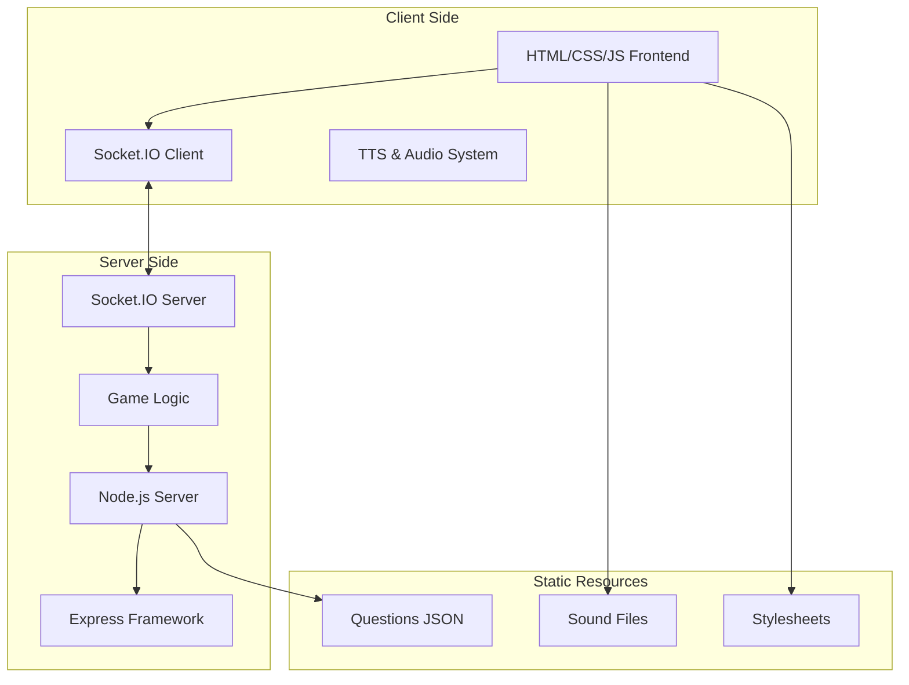
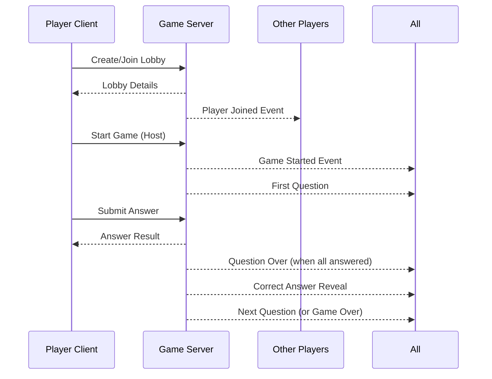

# Multiplayer Web Quiz Game

A real-time multiplayer quiz application built with Node.js, Express, and Socket.IO. Players can create lobbies, join games, and compete in interactive quizzes with text-to-speech, sound effects, and live scoring.

## 🎮 Features

- **Real-time Multiplayer**: Up to 8 players per lobby
- **Interactive UI**: Modern, responsive design with animated feedback
- **Text-to-Speech**: Questions and answers are read aloud (when unmuted)
- **Sound Effects**: Immersive audio for game events
- **Live Scoring**: Real-time score updates with streak tracking
- **Game Management**: Host controls (pause/resume, play again)
- **Category Selection**: Multiple question categories available
- **Responsive Design**: Works on desktop and mobile devices

## 🏗️ Architecture Overview



## 📂 Project Structure

```
quiz-game/
├── server.js          # Main server file with Socket.IO logic
├── public/            # Static frontend files
│   ├── index.html     # Main HTML structure
│   ├── script.js      # Client-side JavaScript
│   ├── style.css      # Custom styles
│   └── sounds/        # Audio files directory
├── questions.json     # Quiz questions database
├── package.json       # Node.js dependencies
├── docker-compose.yml # Docker configuration
└── README.md          # This file
```

## 🚀 Quick Start

### Prerequisites

- Node.js (v14 or higher)
- npm or yarn
- Docker & Docker Compose (optional)

### Local Development

1. **Clone the repository**
   ```bash
   git clone <repository-url>
   cd quiz-game
   ```

2. **Install dependencies**
   ```bash
   npm install
   ```

3. **Start the development server**
   ```bash
   npm run dev
   ```

4. **Access the game**
   Open your browser and navigate to `http://localhost:3000`

### Docker Deployment

1. **Build and run with Docker Compose**
   ```bash
   docker-compose up -d
   ```

2. **Access the game**
   Open your browser and navigate to `http://localhost:4000`

## 🎯 How to Play

### Creating a Lobby
1. Enter your player name
2. Click "Lobby erstellen" (Create Lobby)
3. Share the generated lobby ID with other players
4. Select a quiz category
5. Start the game when ready

### Joining a Game
1. Enter your player name
2. Input the lobby ID
3. Click "Lobby beitreten" (Join Lobby)
4. Wait for the host to start the game

### Gameplay
- Questions are read aloud automatically
- Click on your answer choice within the time limit
- Earn more points for correct answers and maintaining streaks
- Faster answers receive bonus points

## 🔧 Technical Details

### Server Architecture

**Key Components:**

1. **Express Server**: Serves static files and handles HTTP requests
2. **Socket.IO**: Manages real-time communication between clients
3. **Game State Management**: Tracks lobbies, players, and quiz progress
4. **Question System**: Loads and manages quiz categories and questions

**Core Server Functions:**

```javascript
// Key Socket.IO events
socket.on('createLobby', playerName => { /* ... */ });
socket.on('joinLobby', { lobbyId, playerName } => { /* ... */ });
socket.on('startGame', { lobbyId, categoryKey } => { /* ... */ });
socket.on('submitAnswer', { lobbyId, questionIndex, answer } => { /* ... */ });
```

### Client Architecture

**Key Components:**

1. **UI Management**: Dynamic screen switching and state updates
2. **Socket Communication**: Real-time event handling
3. **Audio System**: TTS and sound effect management
4. **Game State**: Local state synchronization with server

**Client Features:**

- Responsive design using Tailwind CSS
- Real-time score updates
- Answer feedback with visual highlighting
- Host-only game controls (pause/resume)

### Data Flow



## 📝 Configuration

### Question Format

Questions are stored in `questions.json` with the following structure:

```json
{
  "Category_Name": [
    {
      "question": "Question text here?",
      "options": ["Option 1", "Option 2", "Option 3", "Option 4"],
      "answer": "Correct Option"
    }
  ]
}
```

### Audio Configuration

- **Sound Effects**: 30% volume by default
- **Menu Music**: 50% volume, loops in menus
- **TTS**: Uses browser's Speech Synthesis API

### Game Settings

```javascript
const QUESTION_TIME_LIMIT = 60; // seconds
const CORRECT_ANSWER_DISPLAY_DURATION = 3000; // milliseconds
const MAX_PLAYERS = 8; // maximum players per lobby
```

## 🎨 Styling

The game uses:
- **Tailwind CSS**: For responsive utility classes
- **Custom CSS**: For specific game elements and animations
- **Inter Font**: For clean, modern typography
- **Color Scheme**: Dark theme with accent colors

## 🔊 Audio System

### Text-to-Speech Features:
- Automatic question reading
- Answer reveal announcements
- Mute/unmute toggle
- German language support

### Sound Effects:
- Button clicks
- Correct/incorrect answer feedback
- Game events (player joined, game start, etc.)
- Time's up warning

## 🐛 Troubleshooting

### Common Issues:

1. **Questions not loading**
   - Check `questions.json` format
   - Verify file permissions

2. **Socket connection failed**
   - Ensure port 3000 is available
   - Check firewall settings

3. **Audio not working**
   - User interaction required for audio playback
   - Check browser permissions

### Debug Mode:

Enable detailed logging by checking the browser console for `[DEBUG]` messages.

## 🚀 Contributing

1. Fork the repository
2. Create a feature branch
3. Make your changes
4. Test thoroughly
5. Submit a pull request

## 📄 License

This project is licensed under the ISC License - see the package.json file for details.

## 🙏 Acknowledgments

- Built with Node.js and Socket.IO
- Styled with Tailwind CSS
- Icons from Bootstrap Icons
- Uses browser Speech Synthesis API for TTS

---

**Have fun quizzing!** 🎮🏆